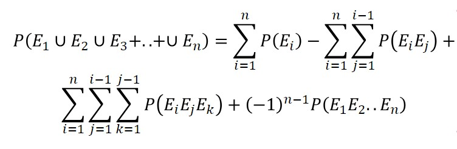
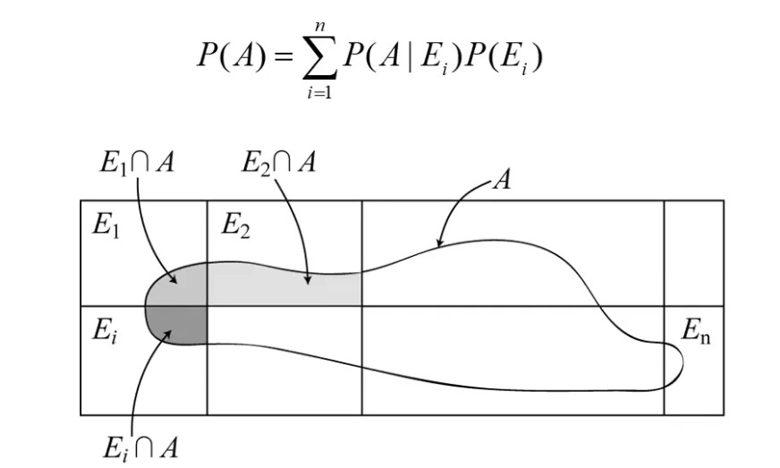

# June 29th Lecture
- A **random event** is an event that has more than one possible outcome
    - The **sample space** *S* is the collection of all possible outcomes of a random event
    - Any subset of the sample space is an event, denoted as *E*
- Example: Rolling a die
    - $S=\{1, 2, 3, 4, 5, 6\}$
    - $E_{odd}=\{1, 3, 5\}$
    - $E_{greater \; than \; 3}= \{4, 5, 6\}$
- Set Operation Laws:  
    - Commutation:
        - $E_1\cup E_2= E_2 \cup E_1$
        - $E_1\cap E_2= E_2 \cap E_1$
    - Association:
        - $E_1 \cup (E_2 \cup E_3) = (E_1 \cup E_2) \cup E_3 = E_1 \cup E_2 \cup E_3$
        - $E_1 \cap (E_2 \cap E_3) = (E_1 \cap E_2) \cap E_3 = E_1 \cap E_2 \cap E_3$
    - Distribution:
        - $E_1 \cap (E_2 \cup E_3) = (E_1 \cap E_2) \cup (E_1 \cap E_3)$
    - Intersection is analogous to multiplication, and union is analagous to addition
        - This means that intersection takes precedent over union:
            - $E_1 \cap E_2 \cup E_1 \cap E_3 \ne E_1 \cap (E_2 \cup E_3) \cap E_3$
- Special Events:
    - A **certain event** *S* is an event that contains all possible outcomes in the sample space - it is the sample space *S*
    - A **null event** $\emptyset$ is an event that contains no outcomes
    - Events $E_1$ and $E_2$ are **mutually exclusive** when they have no common outcomes - $E_1 \cap E_2 = \emptyset$
    - **Collectively exhaustive** events have their unions spanning the sample space - $E_1 \cup E_2 \cup ... \cup E_n = S$
    - The **complimentary event** $\bar{E_1}$ of an event $E_1$ contains all outcomes in the sample space that are not in event $E_1$
- De Morgan's Laws:
    - $\overline{E_1 \cup E_2 \cup ... \cup E_n} = \overline{E_1} \cap \overline{E_2}  \cap ... \cap \overline{E_n}$
    - $\overline{E_1 \cap E_2 \cap ... \cap E_n} = \overline{E_1} \cup \overline{E_2} \cup ... \cup ... \overline{E_n} $
- **Natural Variance**
    - This is the frequentist interpretation of probability, resulting from inherent randomness
    - This related to the number of observations from repeated experiments - measurements or further study will not affect these numbers
    - The frequentist probability of an occurrence of an event $E$ is equal to the relative frequency of observations $E$ in a large number of repeated experiments
        - $P(E) = \lim_{x \to\infty} \frac{n}{N}$
            - $n$ is the number of occurences of $E$ in $N$ observations
    - Examples (Measurement will not reduce this uncertainty):
        - The probability of exceeding a ground shaking intensity of 1g in the next 100 years
        - Maximum wind speed in a year
        - Live load on a building
- **Incomplete Knowledge**, 
    - This is the *Bayesian* interpretation of probabilities, which is a way of quantifying a degree of belief in an unknown outcome, and it *can* be reduced by further tests or measurements
    - The probability of an event $E$ represents the analyst's degree of belief that $E$ will occur
        - If you believe a proposition to be true with degree of belief $p$, and I offer you the following bet:
            - You pay me $x
            - I pay you $y if the proposition is true
            - You will accept the bet only if $\frac{y}{x} > \frac{1}{p}$
    - Examples (Measurement will reduce this uncertainty):
        - Probability of finding water on a new planet
        - Probability that a building will collapse under a ground shaking intensity of 1g
        - Election results
- Probability of a Union:
    - Two Events: $P(E_1 \cup E_2) = P(E_1) + P(E_2) - P(E_1 \cap E_2)$
    - Three Events: $P(E_1 \cup E_2 \cup E_3) = P(E_1) + P(E_2) + P(E_3) - P(E_1 E_2) - P(E_1 E_3) - P(E_2 E_3) + P(E_1 E_2 E_3)$
        - The triple intersection is added three times (from the first three probabilities), but then subtracted three times (from the next three probabilities), so it must be added back in (from the final probability)
    - Generalized:
        - 
- Conditional Probability
    - The probability that event $E_1$ has occurred, given that event $E_2$ has occurred is $P(E_1 | E_2)$
    - $P(E_1 | E_2) = \frac{P(E_1E_2)}{P(E_2)}$
        - $P(E_1 E_2) = P(E_1 | E_2) P(E_2)$
    - $P(E_1 | E_2 E_3) = \frac{P(E_1 E_2 E_3)}{E_2 E_3}$
        - Using the associative property:
            - $P(E_1E_2E_3) = P(E_1 | E_2 E_3)P(E_2E_3) = P(E_1 | E_2 E_3)P(E_2 | E_3)P(E_3)$
            - $P(E_1E_2E_3) = P(E_2 | E_1 E_3)P(E_1E_3) = P(E_2 | E_1 E_3)P(E_1 | E_3)P(E_3)$
            - $P(E_1E_2E_3) = P(E_3 | E_1 E_2)P(E_1E_2) = P(E_3 | E_1 E_2)P(E_1 | E_2)P(E_2)$
- Two events are independent if and only if:
    - $P(E_1 | E_2) = P(E_1)$ or $P(E_2 | E_1) = P(E_2)$
        - $P(E_1 E_2) = P(E_1)P(E_2)$
    - Generalized Independence:
        - $P(E_1E_2...E_n)=P(E_1)P(E_2)...P(E_n)$
- Theorem of Total Probability:
    - Consider an event *A* and a set of mutually exclusive, collectively exhaustive events $E_1, E_2, ... E_n$
        - 
    - The events $E$ *must* be mutually exclusive and collectively exhaustive, meaning that their probabilities should sum to exactly 1
- Bayes' Rule
    - Consider an event *A* and a set of mutually exclusive, collectively exhaustive events $E_1, E_2, ... E_n$ in a sample space *S*
        - $P(AE_j) = P(E_j | A)P(A)$
            - $P(E_jA) = P(A | E_j)P(E_j)$
        - $P(A|E_j)P(E_j)=P(E_j|A)P(A)$
            - $P(E_j |A) = \frac{P(A|E_j)P(E_j)}{P(A)}$
        - Using the Total Probability Theorem:
            - $P(E_j | A) = \frac{P(A|E_j)P(E_j)}{\sum_{i=1}^{n}P(A|E_i)P(E_i)}$