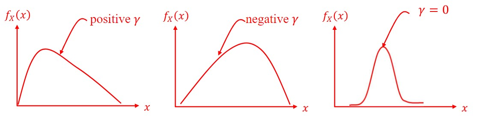
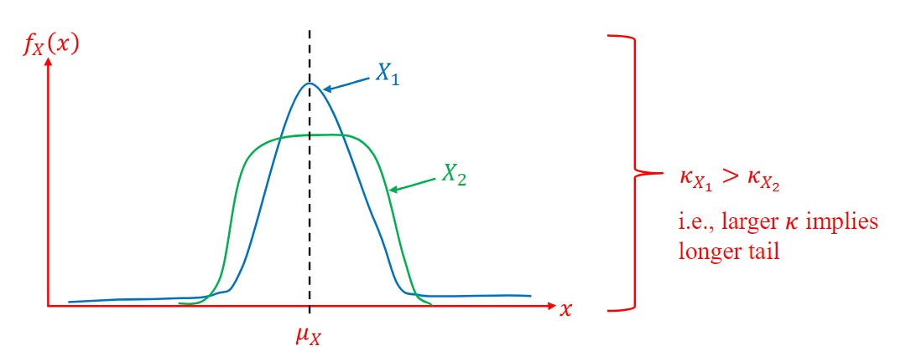

# July 11th Lecture
- Discrete and continous random variables are completely defined by their probability mass functions and probability density functions, respectively
    - This complete information is usually not necessary or even available
    - Sometimes, it is more convenient to use measures that describe general features of a distribution, such as **central location**, **breadth**, and **skewness**
    - These features are known as the **moments** of a random variable
## Mean
- The mean of $X$ is denoted as $\mu_X$ or $E[X]$
- For a discrete random variable, the mean can be calculated as:
    - $\mu_X = \sum_{all \; i}x_i p_x (x_i)$
- For a continous random variable, the mean can be calculated as
    - $\mu_x = \int_{all \; x}xf_X(x)dx$
## Median
- The mean of $X$ is the median, which is often denoted as $x_{0.5}$
- It can be defined mathematically using the cumulative distribution function
    - $F_X(x_{0.5})=0.5$
## Mode
- The mode of a random variable $X$ is the value with the highest probability (discrete random variable) or highest probability density (continuous random variable), and is denoted as $\tilde{x}$
- A probability distribution can have more than one mode (unlike the mean and median)
## Variance
- The mean cannot indicate the level of uncertainty in a random variable - instead, the variance should be used
- Variance is denoted as $var[X]$ or $\sigma ^{2}_x$
- For a discrete random variable, it is defined as:
    - $\sigma_{x}^{2} = \sum_{all \; i }(x_i - \mu_x)^2p_x(x_i)$
- For a continuous random variable, it is defined as:
    - $\sigma_{x}^{2} = \int_{all \; i }(x - \mu_x)^2f_x(x)dx$
- The square root of the standard deviation is the standard deviation, $\sigma_X$
    - $\sigma_X= \sqrt{\int_{all \; i }(x - \mu_x)^2f_x(x)dx}$
- Standard deviation has the same units as $X$
## Coefficient of Variation
- A unitless measure of uncertainty is provided by the coefficient of variation, denoted as $\delta_X$
    - $\delta_X=\frac{\sigma_X}{|\mu_X|}$
- This is useful for comparing random variables with different means
- However, it does not work well when the mean is zero
    - It works best when $\sigma_X \leq |\mu_X|$
## Expectation
- Means and variances are special cases of the expectation operation
- The expectation of $g(X)$ is defined as:
    - $E[g(X)] =  \sum_{all \; i}g(x_i) p_x (x_i)$
    - $E[g(X)]= \int_{all \; x}g(x)f_X(x)dx$
- The mean is the case where $g(X) = X$ and the variance is the case where $g(X) = (X - \mu_X)^2$
- Since summation and integration are linear operators, the expectation is also a linear operator
    - $E[g_1(x) + g_2(X)] = E[g_1(X)] + E[g_2(X)]$
    - $E[cX] = cE[X]$
    - $E[c] = \int_{all \; x}cf_X(x)dx = c(1) = c$
        - The integral of a PDF over all x is just 1
    - $E[a +bX] = a + bE[X]$
    - $Var[cX] = E[(cX - c\mu_X)^2] = E[c^2(X-\mu_X)^2] = c^2Var[X]$
## Moments of a Random Variable
- The function $g(X) = X^m$, where $m$ is a positive integer, is an important function
    - $E[X^m]$ is called the $m^{th}$ moment of $X$
- The function $g(X) = (X - \mu_X)^m$ provides the *central moments* of $X$
- $m = 1$:
    - $E[(X-\mu_X)^1] = E[X] - \mu_X = 0$
- $m = 2$:
    - $E[(X-\mu_X)^2] = E[X^2] - 2\mu_XE[X] + \mu_X^2 = E[X^2] - \mu_X^2$
    - This is the variance
- $m = 3$
    - The $3^{rd}$ central moment, normalized by $\sigma_X$, is the **coefficient of skewness**
    - $\gamma = \frac{E[(X-\mu_X)^3]}{\sigma_X^3}$
    - Positive values of $\gamma$ indicate a long tail to the right and negative values of $\gamma$ indicate a long tail to the left
    - 
- $m = 4$
    - The $4^{th}$ central moment, normalized by $\sigma_X$, is the **kurtosis coefficient**
    - $\kappa=\frac{E[(X-\mu_X)^4]}{\sigma_X^4}$
    - Higher values of $\kappa$ indicate a longer tail
    - 
- In general, all moments of a random variable must be known to have complete knowledge of a random variable
    - A partial description of the random variable can be known from just the first four moments
## Joint Moments of Random Variables
- The joint central moment of two random variables is known as the **covariance**
    - $\sigma_{X, Y} = E[(X - \mu_X)(Y - \mu_Y)] = \int_{-\infty}^{\infty}\int_{-\infty}^{\infty}(x-\mu_X)(y-\mu_Y)f_{X,Y}(x,y)dxdy$
        - $\sigma_{X, Y} = E[(X - \mu_X)(Y - \mu_Y)]  = E[XY] - \mu_X\mu_Y$ 
    - Covariance is the measure of **linear** dependence between two random variables
- The covariance of $X$ with itself is equal to the variance of $X$
    - $\sigma_{X, X} = E[(X-\mu_X)(X-\mu_X)] = E[(X-\mu_X)^2] = \sigma_X^2$
- $|\sigma_{X, Y}| \leq \sqrt{\sigma_X^2 \sigma_Y^2}$    
### Correlation Coefficient
- The normalized version of the covariance is known as the **correlation coefficient**
- $\rho_{X, Y} = \frac{\sigma_{X, Y}}{\sigma_X \sigma_Y}$
     - This will always be between $[-1, 1]$ since $|\sigma_{X, Y}| \leq \sqrt{\sigma_X^2 \sigma_Y^2}$ 
- The correlation coefficient is a dimensionless measure of **linear** dependence between $X$ and $Y$
    - A correlation coefficient of zero $X$ and $Y$ are uncorrelated
### Independent versus Uncorrelated
- If $X$ and $Y$ are independent, they are also uncorrelated
    - Independence implies uncorrelation, but uncorrelation does not necessarily imply independence
- $\sigma_{X, Y} = E[XY] - \mu_X\mu_Y$
    - If $X$ and $Y$ are independent, then: 
        - $E[XY] = \int_{-\infty}^{\infty}\int_{-\infty}^{\infty}xyf_{X,Y}(x,y)dxdy$
        - $E[XY] = (\int_{-\infty}^{\infty}xf_x(x)dx)(\int_{-\infty}^{\infty}yf_y(y)dy) = \mu_X\mu_Y$
    - Thus, $\sigma_{X, Y} = E[XY] - \mu_X\mu_Y = 0$
### Dependence versus Correlation
- Two variables $A$ and $B$ are **dependent** if they are **associated in any way** or one variable provides information about the other
    - If $A$ and $B$ are independent, then there is no association
    - Independence occurs if:
        - $P(A|B) = P(A)$ or $P(B|A) = P(B)$
- $A$ and $B$ are correlated if they show a **monotonically increasing or decreasing trend**
    - Correlation implies dependence but dependence does not imply correlation
- Correlation reflects the noisiness and direction of a linear relationship, but not the slope of the relationship, nor many aspects of nonlinear relationships