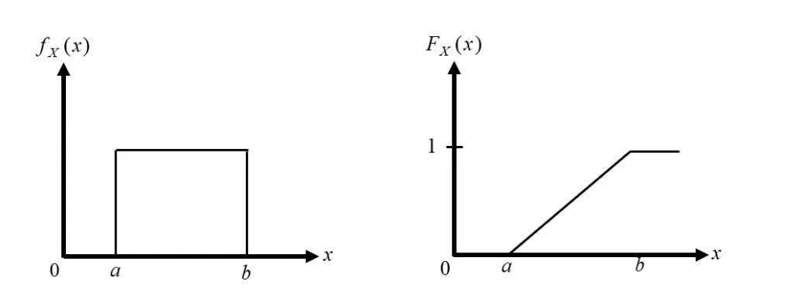
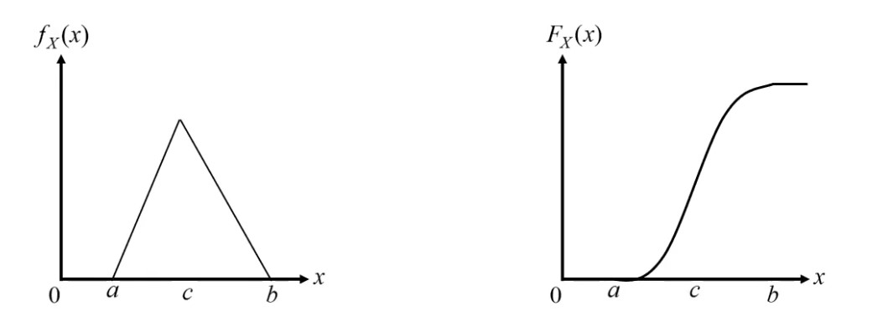

# August 3rd Lecture
## The Uniform Distribution
- If a variable is equally likely to take on any value in that interval from $a$ to $b$, its density function is constant over that range
    - $f_X = \{a \leq x \leq b:\frac{1}{b-a}, otherwise: 0\}$
    - $F_X(x)=\{x < a: 0, a \leq x \leq b: \frac{x-a}{b-a}, x >b: 1\}$
    - 
- Moments:
    - $\mu_X = \frac{b + a}{2}$
    - $\sigma_X = \sqrt{E[x^2]-\mu_X^2} = \frac{b-a}{\sqrt{12}}$ 
## The Triangular Distribution
- A triangular distribution is defined by a lower limit $a$, an upper limit $b$, and a mode $c$
    - $f_X(x)=\{x < a: 0, a \leq x \leq c: \frac{2(x-a)}{(b-a)(c-a)}, c \leq x \leq b: \frac{2(b-x)}{(b-a)(b-c)}, x > b : 0\}$
    - $F_X(x)=\{x < a: 0, a \leq x \leq c: \frac{(x-a)^2}{(b-a)(c-a)}, c \leq x \leq b: 1 - \frac{(b-x)}{(b-a)(b-c)}, x > b : 1\}$
    - 
- Moments:
    - $\mu_X = \frac{a + b + c}{3}$
    - $\sigma_X^2 = \frac{a^2 + b^2 + c^2 - ab -ac - bc}{18}$
## The Beta Distribution
- The Beta Distribution is a generalization of the uniform distribution
    - $f_X(x) = \frac{(x-a)^{q - 1}(b-x^{r-1})}{B(q, r)(b -a)^{q + r - 1}}$
        - $q$ and $r$ are positive constants that specify the distribution's shape
        - $B(q,r) = \frac{\Gamma(q)\Gamma(r)}{\Gamma(q+ r)}$
- Moments:
    - $\mu_X = \frac{ar + bq}{q + r}$
    - $\sigma_X = \sqrt{\frac{qr}{q + r + 1}}(\frac{b-a}{q + r})$