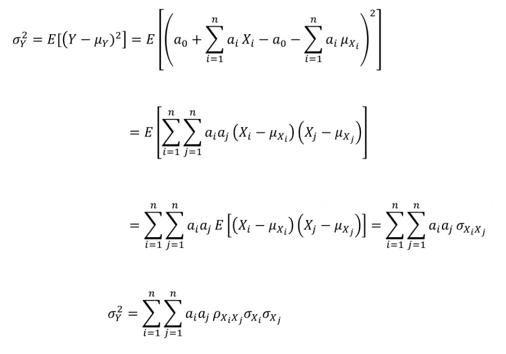

# August 8th Lecture
## Functions of Random Variables
- If the inputs into a function are random variables, then the output will also be a random variable
- Consider the distribution of $Y$, which is a function of random variables $X_1, X_2, ..., X_n$
    - $Y = g(X_1, X_2, ..., X_n)$
## Moments of Linear Functions
- Linear Function: $Y = a_0 + \sum_{i=1}^na_iX_i$
- $\mu_Y = E[Y] = E[a_0 + \sum_{i=1}^na_iX_i] = a_0 + \sum_{i=1}^na_iE[X_i] = a_0 + \sum_{i=1}^na_i\mu_{X_i}$
- $\sigma_Y^2 = E[(Y-\mu_Y)^2] = \sum_{i=1}^n \sum_{j = 1}^n a_i a_j \rho_{X_i X_j} \sigma_{X_i}\sigma_{X_j}$
    - 
- In the special case of $Y = aX + b$:
    - $\mu_Y = a\mu_X + b$
    - $\sigma_Y = a\sigma_X$
- Example: Cantilever (L = 10) supports a concentrated load $P$ and a uniformly distributed $Q$, both of which are random. For $P$: $\mu_P = 50$ and $\sigma_P = 10$. For $Q$: $\mu_Q = 5$ and $\sigma_Q = 2$. The correlation coefficient between the two is $\rho_{P, Q} = 0.1$. Find the mean and standard deviation of the bending moment distribution, $M = \frac{QL^2}{2} + PL = 50Q + 10P$
    - $\mu_M = 50\mu_Q + 10\mu_P = 750$
    - $\sigma_Y^2 = \sum_{i=1}^n \sum_{j = 1}^n a_i a_j \rho_{X_i X_j} \sigma_{X_i}\sigma_{X_j} = (50)^2(1)(2)^2+50(10)(0.1)(2)(10)+(10)(50)(0.1)(10)(2)+10^2(1)(10)^2 = 22000$
        - Note that a correlation of a random variable with itself is just 1
## Approximate Moments of Nonlinear Functions
- Taylor Series expansion can be used to approximate a nonlinear function into a linear one, and then the aforementioned linear moments can be utilized
- Let $g(\bold{X})$ be a nonlinear function of random variables, where $\bold{X} = [X_1, X_2, ..., X_n]$ and let $\bold{\tilde{x}}=[\tilde{x_1}, \tilde{x_2}, ..., \tilde{x_n}]$
- First Order Taylor Series expansion:
    - $Y = g(\tilde{x})+ \sum_{i = 1}^n(X_i - \tilde{x_i})\frac{\partial g}{\partial x_i} |_{x=\tilde{x}}$
    - $Y = g(\tilde{x}) - \sum_{i = 1}^n \tilde{x_i} \frac{\partial g}{\partial x_i} |_{x=\tilde{x}} + \sum_{i = 1}^nX_i \frac{\partial g}{\partial x_i} |_{x=\tilde{x}}$
- Approximate Moments:
    - $\mu_Y \approx g(\tilde{x}) - \sum_{i = 1}^n \tilde{x_i} \frac{\partial g}{\partial x_i} |_{x=\tilde{x}} + \sum_{i = 1}^n \mu_{X_i} \frac{\partial g}{\partial x_i} |_{x=\tilde{x}}$
    - $\sigma_Y^2 \approx \sum_{i = 1}^{n} \sum_{j = 1}^{n} \frac{\partial g \partial g}{\partial x_i \partial x_j} |_{x = \tilde{x}} \rho_{X_i X_j} \sigma_{X_i}\sigma_{X_j}$
- Typically, $\tilde{x}$ is set to equal the mean of $\bold{X}$, so $\tilde{x} = [\mu_{X_1}, \mu_{X_2}, ..., \mu_{X_n}]$, so:
    - $\mu_Y \approx g(\mu_{X_1}, \mu_{X_2}, ..., \mu_{X_n})$
    - $\sigma_Y^2 \approx \sum_{i = 1}^{n} \sum_{j = 1}^{n} \frac{\partial g \partial g}{\partial x_i \partial x_j} |_{x = \mu_X} \rho_{X_i X_j} \sigma_{X_i}\sigma_{X_j}$
- In the special case of $Y = g(X)$:
    - $\mu_Y \approx g(\mu_X)$
    - $\sigma_Y \approx \frac{\partial g}{\partial x_i} |_{X = \mu_X} \sigma_X$ 
- This form of approximation is known as **First-Order Second-Moment** analysis
## Exact Results for Some Nonlinear Functions
- If a function of interest is monotonically increasing and a function of only a single random variable, the exact result for the distribution of $Y$ can be found
- Because it is monotonically increasing, $Y$ being less than or equal to some value $y_0$ means that $X$ is less than or equal to some value
    - $P(Y \leq y_0) = P(X \leq x_0)$
- Since the function is monotonically increasing, its inverse can be found:
    $X = g^{-1}(y)$
- Thus:
    - $F_Y(y) = P(Y \leq y) = P(X \leq g^{-1}(y)) = F_X(g^{-1}(y))$